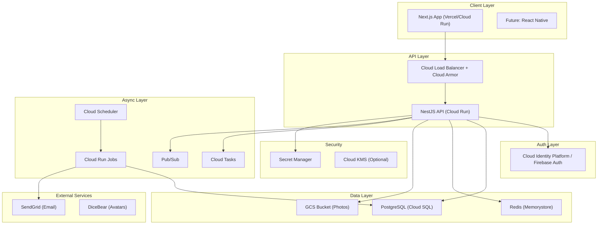

# At-Tayyibun Muslim Matrimony Web Application - Implementation Plan

> A privacy-first, halal-oriented matrimony platform for Muslims in the United States.


---

## Assumptions & Design Decisions

### Documented Assumptions

| Area | Assumption |
|------|------------|
| **Deployment Region** | GCP `us-central1` for US-focused audience |
| **Email Provider** | SendGrid with API key stored in Secret Manager |
| **AI Avatar** | Use DiceBear API (open-source avatar generator) - no ML models needed |
| **Image Processing** | Sharp.js for WebP/AVIF conversion; target thumbnail 150px, display 600px |
| **Encryption Key Rotation** | Manual rotation via admin; decrypt with old key, re-encrypt with new |
| **Membership Tiers** | Free, Silver, Gold (expandable) |
| **Phone Format** | US phone numbers (+1 prefix); use libphonenumber for validation |
| **Instagram OAuth** | Design interface but mark as TODO pending Meta App Review |
| **Session Duration** | 7 days for remember-me; 1 hour for sensitive actions |
| **Rate Limits** | Login: 5/min, Signup: 3/min, Browse: 60/min, Request: 10/hour |
| **File Size Limits** | Max 10MB original photo; stored as <200KB optimized |

### Brand Identity
- **Primary Colors**: Gold (#D4AF37), Deep Purple (#4A0E4E), White (#FFFFFF)
- **Fonts**: Inter (headings), Roboto (body)
- **Tone**: Respectful, marriage-focused (nikah), professional

---

## System Architecture



### Component Responsibilities

| Component | Responsibility |
|-----------|----------------|
| **Next.js Frontend** | SSR/CSR hybrid, SPA-like profile transitions, TailwindCSS styling |
| **NestJS API** | REST endpoints, business logic, authorization, encryption |
| **Cloud Identity Platform** | OAuth flows, phone verification, session management |
| **PostgreSQL** | Primary data store, encrypted biodata columns |
| **Redis** | Session cache, rate limiting, request locks |
| **GCS** | Private photo storage, signed URL generation |
| **Cloud Tasks** | Async job dispatch (email, image processing) |
| **Cloud Scheduler** | Cron jobs (expiration check, gold boost) |

---

## Repository Structure

```
at-tayyibun/
├── .github/
│   └── workflows/
│       ├── ci.yml
│       ├── deploy-staging.yml
│       └── deploy-prod.yml
├── apps/
│   ├── web/                          # Next.js Frontend
│   │   ├── app/
│   │   │   ├── (public)/
│   │   │   │   ├── page.tsx          # Landing
│   │   │   │   ├── profiles/
│   │   │   │   │   └── [publicId]/
│   │   │   │   │       └── page.tsx
│   │   │   │   ├── login/
│   │   │   │   │   └── page.tsx
│   │   │   │   └── signup/
│   │   │   │       └── page.tsx
│   │   │   ├── (app)/
│   │   │   │   ├── browse/
│   │   │   │   │   └── page.tsx
│   │   │   │   ├── requests/
│   │   │   │   │   └── page.tsx
│   │   │   │   ├── messages/
│   │   │   │   │   └── page.tsx
│   │   │   │   └── pricing/
│   │   │   │       └── page.tsx
│   │   │   ├── (admin)/
│   │   │   │   └── admin/
│   │   │   │       ├── page.tsx
│   │   │   │       ├── users/
│   │   │   │       ├── ads/
│   │   │   │       ├── coupons/
│   │   │   │       ├── campaigns/
│   │   │   │       └── settings/
│   │   │   ├── layout.tsx
│   │   │   └── globals.css
│   │   ├── components/
│   │   │   ├── ui/                   # Reusable UI components
│   │   │   ├── profile/
│   │   │   │   ├── ProfileCard.tsx
│   │   │   │   └── ProfileViewer.tsx
│   │   │   ├── filters/
│   │   │   │   └── FilterBar.tsx
│   │   │   ├── modals/
│   │   │   │   ├── RequestModal.tsx
│   │   │   │   └── ReasonModal.tsx
│   │   │   └── ads/
│   │   │       └── AdSlot.tsx
│   │   ├── lib/
│   │   │   ├── api.ts
│   │   │   ├── auth.ts
│   │   │   └── utils.ts
│   │   ├── public/
│   │   │   ├── logo.png
│   │   │   └── favicon.ico
│   │   ├── next.config.js
│   │   ├── tailwind.config.js
│   │   └── package.json
│   │
│   └── api/                          # NestJS Backend
│       ├── src/
│       │   ├── main.ts
│       │   ├── app.module.ts
│       │   ├── common/
│       │   │   ├── decorators/
│       │   │   │   ├── current-user.decorator.ts
│       │   │   │   └── roles.decorator.ts
│       │   │   ├── guards/
│       │   │   │   ├── auth.guard.ts
│       │   │   │   ├── roles.guard.ts
│       │   │   │   └── object-owner.guard.ts
│       │   │   ├── interceptors/
│       │   │   │   └── audit-log.interceptor.ts
│       │   │   ├── filters/
│       │   │   │   └── http-exception.filter.ts
│       │   │   └── middleware/
│       │   │       └── rate-limit.middleware.ts
│       │   ├── modules/
│       │   │   ├── auth/
│       │   │   │   ├── auth.module.ts
│       │   │   │   ├── auth.controller.ts
│       │   │   │   ├── auth.service.ts
│       │   │   │   ├── strategies/
│       │   │   │   │   ├── jwt.strategy.ts
│       │   │   │   │   ├── google.strategy.ts
│       │   │   │   │   ├── facebook.strategy.ts
│       │   │   │   │   └── oauth-provider.interface.ts
│       │   │   │   └── dto/
│       │   │   ├── users/
│       │   │   │   ├── users.module.ts
│       │   │   │   ├── users.controller.ts
│       │   │   │   ├── users.service.ts
│       │   │   │   └── dto/
│       │   │   ├── profiles/
│       │   │   │   ├── profiles.module.ts
│       │   │   │   ├── profiles.controller.ts
│       │   │   │   ├── profiles.service.ts
│       │   │   │   └── dto/
│       │   │   ├── photos/
│       │   │   │   ├── photos.module.ts
│       │   │   │   ├── photos.controller.ts
│       │   │   │   ├── photos.service.ts
│       │   │   │   └── image-processor.service.ts
│       │   │   ├── requests/
│       │   │   │   ├── requests.module.ts
│       │   │   │   ├── requests.controller.ts
│       │   │   │   └── requests.service.ts
│       │   │   ├── messages/
│       │   │   ├── ads/
│       │   │   ├── coupons/
│       │   │   ├── memberships/
│       │   │   ├── admin/
│       │   │   └── campaigns/
│       │   ├── services/
│       │   │   ├── encryption.service.ts
│       │   │   ├── email.service.ts
│       │   │   ├── avatar.service.ts
│       │   │   ├── storage.service.ts
│       │   │   └── audit.service.ts
│       │   └── prisma/
│       │       ├── schema.prisma
│       │       └── migrations/
│       ├── test/
│       │   ├── auth.e2e-spec.ts
│       │   ├── requests.e2e-spec.ts
│       │   └── authorization.e2e-spec.ts
│       └── package.json
│
├── packages/
│   └── shared/                       # Shared types/utils
│       ├── types/
│       └── constants/
│
├── jobs/                             # Cloud Run Jobs
│   ├── request-expiry/
│   │   ├── Dockerfile
│   │   └── index.ts
│   ├── gold-boost/
│   │   ├── Dockerfile
│   │   └── index.ts
│   └── image-processor/
│       ├── Dockerfile
│       └── index.ts
│
├── infra/                            # Terraform IaC
│   ├── main.tf
│   ├── variables.tf
│   ├── outputs.tf
│   ├── modules/
│   │   ├── cloud-run/
│   │   ├── cloud-sql/
│   │   ├── memorystore/
│   │   ├── storage/
│   │   ├── secrets/
│   │   └── scheduler/
│   └── environments/
│       ├── staging.tfvars
│       └── prod.tfvars
│
├── docs/
│   ├── api-spec.md
│   ├── security-checklist.md
│   └── deployment.md
│
├── docker-compose.yml                # Local dev
├── turbo.json                        # Turborepo config
├── package.json
└── README.md
```

---

## Database Schema (Prisma)

### Entity Relationship Diagram

```mermaid
erDiagram
    users ||--o| profiles : has
    users ||--o{ photos : uploads
    users ||--o{ info_requests_sent : sends
    users ||--o{ info_requests_received : receives
    users ||--o{ skip_reasons : records
    users ||--o{ messages_sent : sends
    users ||--o{ messages_received : receives
    users ||--o{ audit_logs : generates
    ads ||--o{ ad_impressions : tracks
    coupons }o--|| partners : belongs_to
    email_campaigns ||--o{ campaign_recipients : has
    form_schemas ||--o{ form_fields : contains
    
    users {
        uuid id PK
        string public_id UK "nanoid(12)"
        string email UK
        string phone UK
        string password_hash "nullable(OAuth)"
        enum role "user|admin|super_admin"
        enum membership_tier "free|silver|gold"
        boolean is_verified
        datetime membership_expires_at
        int rank_boost "default 0"
        datetime rank_boosted_at
        datetime created_at
        datetime updated_at
    }
    
    profiles {
        uuid id PK
        uuid user_id FK UK
        string first_name
        string last_name "encrypted"
        date dob
        enum gender "male|female"
        string ethnicity
        text bio "encrypted"
        text biodata_json "encrypted AES-256-GCM"
        json public_fields "minimal visible"
        uuid ai_avatar_id FK
        boolean profile_complete
        datetime updated_at
    }
    
    photos {
        uuid id PK
        uuid user_id FK
        enum type "ai_avatar|real_photo"
        string gcs_original_path
        string gcs_thumbnail_path
        string gcs_display_path
        boolean is_primary
        enum visibility "private|approved_only"
        boolean admin_approved
        datetime created_at
    }
    
    info_requests {
        uuid id PK
        uuid requester_id FK
        uuid target_id FK
        enum status "pending|approved|denied|expired"
        json allowed_shares "photo|phone|email"
        datetime created_at
        datetime expires_at
        datetime responded_at
        string one_time_token UK "nullable"
        datetime token_used_at
    }
    
    skip_reasons {
        uuid id PK
        uuid requester_id FK
        uuid target_id FK
        string reason_code
        text custom_text
        datetime created_at
    }
    
    messages {
        uuid id PK
        uuid sender_id FK
        uuid recipient_id FK
        text content "encrypted"
        boolean is_read
        datetime created_at
    }
    
    ads {
        uuid id PK
        uuid partner_id FK
        string title
        string image_url
        string click_url
        json frequency_rules "by tier"
        boolean is_active
        datetime start_date
        datetime end_date
    }
    
    partners {
        uuid id PK
        string name
        string website
        boolean is_active
    }
    
    coupons {
        uuid id PK
        uuid partner_id FK
        string code
        string description
        string redirect_url
        json tracking_params
        datetime valid_from
        datetime valid_until
        boolean is_active
    }
    
    form_schemas {
        uuid id PK
        string name
        int version
        boolean is_active
        datetime created_at
    }
    
    form_fields {
        uuid id PK
        uuid schema_id FK
        string field_name
        string field_type
        string label
        boolean required
        json options
        int display_order
        boolean is_encrypted
    }
    
    audit_logs {
        uuid id PK
        uuid user_id FK
        string action
        string resource_type
        uuid resource_id
        json metadata "no secrets"
        string ip_address
        datetime created_at
    }
    
    email_campaigns {
        uuid id PK
        uuid created_by FK
        string subject
        text template
        enum status "draft|sending|sent"
        int total_recipients
        int sent_count
        datetime scheduled_at
        datetime sent_at
    }
    
    campaign_recipients {
        uuid id PK
        uuid campaign_id FK
        uuid user_id FK
        boolean sent
        boolean opened
        boolean unsubscribed
    }
    
    unsubscribes {
        uuid id PK
        uuid user_id FK UK
        datetime created_at
    }
```

### Prisma Schema

```prisma
// apps/api/src/prisma/schema.prisma

generator client {
  provider = "prisma-client-js"
}

datasource db {
  provider = "postgresql"
  url      = env("DATABASE_URL")
}

enum Role {
  USER
  ADMIN
  SUPER_ADMIN
}

enum MembershipTier {
  FREE
  SILVER
  GOLD
}

enum Gender {
  MALE
  FEMALE
}

enum PhotoType {
  AI_AVATAR
  REAL_PHOTO
}

enum PhotoVisibility {
  PRIVATE
  APPROVED_ONLY
}

enum RequestStatus {
  PENDING
  APPROVED
  DENIED
  EXPIRED
}

enum CampaignStatus {
  DRAFT
  SENDING
  SENT
}

model User {
  id                  String          @id @default(uuid()) @db.Uuid
  publicId            String          @unique @map("public_id") @db.VarChar(16)
  email               String          @unique @db.VarChar(255)
  phone               String          @unique @db.VarChar(20)
  passwordHash        String?         @map("password_hash")
  role                Role            @default(USER)
  membershipTier      MembershipTier  @default(FREE) @map("membership_tier")
  isVerified          Boolean         @default(false) @map("is_verified")
  membershipExpiresAt DateTime?       @map("membership_expires_at")
  rankBoost           Int             @default(0) @map("rank_boost")
  rankBoostedAt       DateTime?       @map("rank_boosted_at")
  createdAt           DateTime        @default(now()) @map("created_at")
  updatedAt           DateTime        @updatedAt @map("updated_at")

  profile               Profile?
  photos                Photo[]
  sentRequests          InfoRequest[]       @relation("RequestsSent")
  receivedRequests      InfoRequest[]       @relation("RequestsReceived")
  skipReasonsGiven      SkipReason[]        @relation("SkipReasonsGiven")
  skipReasonsReceived   SkipReason[]        @relation("SkipReasonsReceived")
  sentMessages          Message[]           @relation("MessagesSent")
  receivedMessages      Message[]           @relation("MessagesReceived")
  auditLogs             AuditLog[]
  createdCampaigns      EmailCampaign[]
  campaignRecipients    CampaignRecipient[]
  unsubscribe           Unsubscribe?

  @@map("users")
}

model Profile {
  id              String   @id @default(uuid()) @db.Uuid
  userId          String   @unique @map("user_id") @db.Uuid
  firstName       String   @map("first_name") @db.VarChar(100)
  lastNameEnc     String   @map("last_name_enc") // Encrypted
  dob             DateTime @db.Date
  gender          Gender
  ethnicity       String   @db.VarChar(50)
  bioEnc          String?  @map("bio_enc") // Encrypted
  biodataJsonEnc  String?  @map("biodata_json_enc") // Encrypted JSON
  publicFields    Json?    @map("public_fields") // Minimal visible data
  aiAvatarId      String?  @map("ai_avatar_id") @db.Uuid
  profileComplete Boolean  @default(false) @map("profile_complete")
  updatedAt       DateTime @updatedAt @map("updated_at")

  user     User   @relation(fields: [userId], references: [id], onDelete: Cascade)
  aiAvatar Photo? @relation("AiAvatar", fields: [aiAvatarId], references: [id])

  @@map("profiles")
}

model Photo {
  id               String          @id @default(uuid()) @db.Uuid
  userId           String          @map("user_id") @db.Uuid
  type             PhotoType
  gcsOriginalPath  String?         @map("gcs_original_path")
  gcsThumbnailPath String?         @map("gcs_thumbnail_path")
  gcsDisplayPath   String?         @map("gcs_display_path")
  isPrimary        Boolean         @default(false) @map("is_primary")
  visibility       PhotoVisibility @default(PRIVATE)
  adminApproved    Boolean         @default(false) @map("admin_approved")
  createdAt        DateTime        @default(now()) @map("created_at")

  user             User      @relation(fields: [userId], references: [id], onDelete: Cascade)
  avatarForProfile Profile[] @relation("AiAvatar")

  @@map("photos")
}

model InfoRequest {
  id            String        @id @default(uuid()) @db.Uuid
  requesterId   String        @map("requester_id") @db.Uuid
  targetId      String        @map("target_id") @db.Uuid
  status        RequestStatus @default(PENDING)
  allowedShares String[]      @map("allowed_shares") // ["photo", "phone", "email"]
  createdAt     DateTime      @default(now()) @map("created_at")
  expiresAt     DateTime      @map("expires_at")
  respondedAt   DateTime?     @map("responded_at")
  oneTimeToken  String?       @unique @map("one_time_token")
  tokenUsedAt   DateTime?     @map("token_used_at")

  requester User @relation("RequestsSent", fields: [requesterId], references: [id])
  target    User @relation("RequestsReceived", fields: [targetId], references: [id])

  // Ensure only one active request per requester
  @@unique([requesterId, status], name: "one_active_request")
  @@map("info_requests")
}

model SkipReason {
  id          String   @id @default(uuid()) @db.Uuid
  requesterId String   @map("requester_id") @db.Uuid
  targetId    String   @map("target_id") @db.Uuid
  reasonCode  String   @map("reason_code") @db.VarChar(50)
  customText  String?  @map("custom_text")
  createdAt   DateTime @default(now()) @map("created_at")

  requester User @relation("SkipReasonsGiven", fields: [requesterId], references: [id])
  target    User @relation("SkipReasonsReceived", fields: [targetId], references: [id])

  @@map("skip_reasons")
}

model Message {
  id          String   @id @default(uuid()) @db.Uuid
  senderId    String   @map("sender_id") @db.Uuid
  recipientId String   @map("recipient_id") @db.Uuid
  contentEnc  String   @map("content_enc") // Encrypted
  isRead      Boolean  @default(false) @map("is_read")
  createdAt   DateTime @default(now()) @map("created_at")

  sender    User @relation("MessagesSent", fields: [senderId], references: [id])
  recipient User @relation("MessagesReceived", fields: [recipientId], references: [id])

  @@map("messages")
}

model Partner {
  id       String  @id @default(uuid()) @db.Uuid
  name     String  @db.VarChar(100)
  website  String? @db.VarChar(255)
  isActive Boolean @default(true) @map("is_active")

  ads     Ad[]
  coupons Coupon[]

  @@map("partners")
}

model Ad {
  id             String    @id @default(uuid()) @db.Uuid
  partnerId      String    @map("partner_id") @db.Uuid
  title          String    @db.VarChar(100)
  imageUrl       String    @map("image_url")
  clickUrl       String    @map("click_url")
  frequencyRules Json      @map("frequency_rules") // { "free": 3, "silver": 1, "gold": 0 }
  isActive       Boolean   @default(true) @map("is_active")
  startDate      DateTime? @map("start_date")
  endDate        DateTime? @map("end_date")

  partner     Partner        @relation(fields: [partnerId], references: [id])
  impressions AdImpression[]

  @@map("ads")
}

model AdImpression {
  id        String   @id @default(uuid()) @db.Uuid
  adId      String   @map("ad_id") @db.Uuid
  userId    String?  @map("user_id") @db.Uuid
  clicked   Boolean  @default(false)
  createdAt DateTime @default(now()) @map("created_at")

  ad Ad @relation(fields: [adId], references: [id])

  @@map("ad_impressions")
}

model Coupon {
  id             String    @id @default(uuid()) @db.Uuid
  partnerId      String    @map("partner_id") @db.Uuid
  code           String    @db.VarChar(50)
  description    String?
  redirectUrl    String    @map("redirect_url")
  trackingParams Json?     @map("tracking_params")
  validFrom      DateTime? @map("valid_from")
  validUntil     DateTime? @map("valid_until")
  isActive       Boolean   @default(true) @map("is_active")

  partner Partner @relation(fields: [partnerId], references: [id])

  @@map("coupons")
}

model FormSchema {
  id        String   @id @default(uuid()) @db.Uuid
  name      String   @db.VarChar(100)
  version   Int      @default(1)
  isActive  Boolean  @default(true) @map("is_active")
  createdAt DateTime @default(now()) @map("created_at")

  fields FormField[]

  @@map("form_schemas")
}

model FormField {
  id           String  @id @default(uuid()) @db.Uuid
  schemaId     String  @map("schema_id") @db.Uuid
  fieldName    String  @map("field_name") @db.VarChar(50)
  fieldType    String  @map("field_type") @db.VarChar(30) // text, email, select, etc.
  label        String  @db.VarChar(100)
  required     Boolean @default(false)
  options      Json?   // For select fields
  displayOrder Int     @map("display_order")
  isEncrypted  Boolean @default(false) @map("is_encrypted")

  schema FormSchema @relation(fields: [schemaId], references: [id], onDelete: Cascade)

  @@map("form_fields")
}

model AuditLog {
  id           String   @id @default(uuid()) @db.Uuid
  userId       String?  @map("user_id") @db.Uuid
  action       String   @db.VarChar(100)
  resourceType String   @map("resource_type") @db.VarChar(50)
  resourceId   String?  @map("resource_id") @db.Uuid
  metadata     Json?    // No secrets
  ipAddress    String?  @map("ip_address") @db.VarChar(45)
  createdAt    DateTime @default(now()) @map("created_at")

  user User? @relation(fields: [userId], references: [id])

  @@index([createdAt])
  @@index([action])
  @@map("audit_logs")
}

model EmailCampaign {
  id              String         @id @default(uuid()) @db.Uuid
  createdById     String         @map("created_by_id") @db.Uuid
  subject         String         @db.VarChar(200)
  template        String         // HTML with {{first_name}} placeholders
  status          CampaignStatus @default(DRAFT)
  totalRecipients Int            @default(0) @map("total_recipients")
  sentCount       Int            @default(0) @map("sent_count")
  scheduledAt     DateTime?      @map("scheduled_at")
  sentAt          DateTime?      @map("sent_at")

  createdBy  User                @relation(fields: [createdById], references: [id])
  recipients CampaignRecipient[]

  @@map("email_campaigns")
}

model CampaignRecipient {
  id           String  @id @default(uuid()) @db.Uuid
  campaignId   String  @map("campaign_id") @db.Uuid
  userId       String  @map("user_id") @db.Uuid
  sent         Boolean @default(false)
  opened       Boolean @default(false)
  unsubscribed Boolean @default(false)

  campaign EmailCampaign @relation(fields: [campaignId], references: [id], onDelete: Cascade)
  user     User          @relation(fields: [userId], references: [id])

  @@unique([campaignId, userId])
  @@map("campaign_recipients")
}

model Unsubscribe {
  id        String   @id @default(uuid()) @db.Uuid
  userId    String   @unique @map("user_id") @db.Uuid
  createdAt DateTime @default(now()) @map("created_at")

  user User @relation(fields: [userId], references: [id], onDelete: Cascade)

  @@map("unsubscribes")
}

model SystemConfig {
  key       String   @id @db.VarChar(100)
  value     Json
  updatedAt DateTime @updatedAt @map("updated_at")

  @@map("system_config")
}
```

---

## API Specification

### Authentication Endpoints

| Method | Endpoint | Description | Auth |
|--------|----------|-------------|------|
| POST | `/auth/signup` | Register with email/password | ❌ |
| POST | `/auth/login` | Login with email/password | ❌ |
| POST | `/auth/logout` | Logout | ✅ |
| POST | `/auth/verify-phone` | Verify phone OTP | ✅ |
| GET | `/auth/google` | Initiate Google OAuth | ❌ |
| GET | `/auth/google/callback` | Google OAuth callback | ❌ |
| GET | `/auth/facebook` | Initiate Facebook OAuth | ❌ |
| GET | `/auth/facebook/callback` | Facebook OAuth callback | ❌ |
| POST | `/auth/refresh` | Refresh access token | ✅ |

### Profile Endpoints

| Method | Endpoint | Description | Auth |
|--------|----------|-------------|------|
| GET | `/profiles` | Browse profiles (filtered) | ✅ |
| GET | `/profiles/:publicId` | View single profile | Partial |
| GET | `/profiles/me` | Get current user's profile | ✅ |
| PUT | `/profiles/me` | Update current user's profile | ✅ |
| POST | `/profiles/me/photos` | Upload photo | ✅ |
| DELETE | `/profiles/me/photos/:id` | Delete photo | ✅ |

### Info Request Endpoints

| Method | Endpoint | Description | Auth |
|--------|----------|-------------|------|
| POST | `/requests` | Request info from a user | ✅ |
| GET | `/requests/incoming` | List incoming requests | ✅ |
| GET | `/requests/outgoing` | List outgoing requests | ✅ |
| PUT | `/requests/:id/respond` | Approve/deny request | ✅ |
| GET | `/requests/shared/:token` | View shared info (one-time link) | ❌ |

### Skip/Move On Endpoints

| Method | Endpoint | Description | Auth |
|--------|----------|-------------|------|
| POST | `/skip` | Record skip reason | ✅ |

### Membership Endpoints

| Method | Endpoint | Description | Auth |
|--------|----------|-------------|------|
| GET | `/memberships/plans` | Get available plans | ❌ |
| POST | `/memberships/subscribe` | Subscribe to plan | ✅ |

### Admin Endpoints

| Method | Endpoint | Description | Auth (Role) |
|--------|----------|-------------|-------------|
| GET | `/admin/users` | List all users | ADMIN |
| GET | `/admin/users/:id` | Get user details | ADMIN |
| PUT | `/admin/users/:id` | Update user | ADMIN |
| PUT | `/admin/users/:id/boost` | Set rank boost | ADMIN |
| GET | `/admin/analytics` | Get user analytics | ADMIN |
| GET/POST/PUT/DELETE | `/admin/ads/*` | Manage ads | ADMIN |
| GET/POST/PUT/DELETE | `/admin/coupons/*` | Manage coupons | ADMIN |
| GET/POST/PUT/DELETE | `/admin/form-schema/*` | Manage signup form | SUPER_ADMIN |
| POST | `/admin/admins` | Add admin | SUPER_ADMIN |
| DELETE | `/admin/admins/:id` | Remove admin | SUPER_ADMIN |
| PUT | `/admin/settings/membership` | Toggle membership | SUPER_ADMIN |
| POST | `/admin/campaigns` | Create campaign | ADMIN |

### Example Request/Response

#### POST `/auth/signup`
```json
// Request
{
  "email": "user@example.com",
  "password": "SecureP@ss123",
  "phone": "+15551234567",
  "firstName": "Ahmad",
  "gender": "MALE"
}

// Response 201
{
  "id": "uuid",
  "publicId": "abc123xyz789",
  "email": "user@example.com",
  "phone": "+15551234567",
  "isVerified": false
}
```

#### GET `/profiles?ethnicity=south-asian&sortBy=age&order=asc&page=1&limit=20`
```json
// Response 200
{
  "data": [
    {
      "publicId": "abc123xyz789",
      "firstName": "Ahmad",
      "age": 28,
      "ethnicity": "South Asian",
      "avatarUrl": "https://api.dicebear.com/...",
      "bio": "Looking for a righteous spouse..."
    }
  ],
  "meta": {
    "total": 150,
    "page": 1,
    "limit": 20,
    "pages": 8
  }
}
```

---

## Background Jobs

### 1. Request Expiration Job

**Trigger**: Cloud Scheduler every 15 minutes
**Action**: Find pending requests where `expires_at < NOW()`, update status to `EXPIRED`

```typescript
// jobs/request-expiry/index.ts
async function expireRequests() {
  const expired = await prisma.infoRequest.updateMany({
    where: {
      status: 'PENDING',
      expiresAt: { lt: new Date() }
    },
    data: { status: 'EXPIRED' }
  });
  console.log(`Expired ${expired.count} requests`);
}
```

### 2. Email on Approval Job

**Trigger**: Pub/Sub on request approval
**Action**: Generate signed URLs, send email via SendGrid

### 3. Gold Weekly Boost Job

**Trigger**: Cloud Scheduler every Monday 00:00 UTC
**Action**: Set `rank_boost = 10` for all GOLD members

### 4. Image Processing Job

**Trigger**: Cloud Tasks on photo upload
**Action**: Generate thumbnail (150px) + display (600px) WebP versions

---

## Security Controls Checklist

| Control | Implementation | Status |
|---------|---------------|--------|
| **OWASP ASVS L2** | Following guidelines across all modules | ⬜ |
| **Deny-by-default** | All routes protected by `AuthGuard` unless whitelisted | ⬜ |
| **Object-level authz** | `ObjectOwnerGuard` on all user-specific endpoints | ⬜ |
| **Password hashing** | Argon2id via `argon2` package | ⬜ |
| **Field encryption** | AES-256-GCM via `encryption.service.ts` | ⬜ |
| **Secret management** | All secrets in GCP Secret Manager | ⬜ |
| **TLS everywhere** | Cloud Run + Cloud SQL SSL enforced | ⬜ |
| **HSTS** | Strict-Transport-Security header | ⬜ |
| **CSP** | Content-Security-Policy headers | ⬜ |
| **Input validation** | class-validator + Zod on frontend | ⬜ |
| **Output encoding** | React auto-escapes; backend uses helmet | ⬜ |
| **Parameterized queries** | Prisma ORM only | ⬜ |
| **Rate limiting** | express-rate-limit + Redis | ⬜ |
| **Audit logging** | AuditLogInterceptor on sensitive actions | ⬜ |
| **Signed URLs** | GCS signed URLs for photos (1-hour expiry) | ⬜ |
| **One-time tokens** | Crypto.randomUUID for shared links | ⬜ |

---

## Verification Plan

### Automated Tests

#### 1. Authorization Tests (IDOR/BOLA)

```bash
# Run from apps/api directory
npm run test:e2e -- --grep "authorization"
```

Tests include:
- User A cannot access User B's profile data
- User A cannot approve/deny User B's requests
- Non-admin cannot access admin endpoints
- ADMIN cannot add/remove other admins (SUPER_ADMIN only)

#### 2. Request Expiration Tests

```bash
npm run test -- --grep "request expiration"
```

Tests include:
- Pending request expires after 24 hours
- Expired request cannot be approved
- Email sent on approval, not on expiration

#### 3. One Active Request Constraint

```bash
npm run test -- --grep "one active request"
```

Tests include:
- Cannot create second request while one is pending
- Can create new request after previous is resolved

#### 4. Rate Limit Tests

```bash
npm run test:e2e -- --grep "rate limit"
```

Tests include:
- Login blocked after 5 failed attempts
- Browse limited to 60 requests per minute

### Manual Verification

After deployment to staging:

1. **Signup Flow**: Create account, verify phone, complete profile
2. **Browse & Filter**: Test ethnicity filter and age sort
3. **Request Flow**: Send request, approve/deny, verify email received
4. **Admin Dashboard**: Toggle membership, add ad, view analytics
5. **Mobile Responsiveness**: Test all pages on iPhone/Android viewports

---

## GCP Infrastructure (Terraform)

```hcl
# infra/main.tf (excerpt)

provider "google" {
  project = var.project_id
  region  = var.region
}

# Cloud Run - API
resource "google_cloud_run_service" "api" {
  name     = "at-tayyibun-api"
  location = var.region

  template {
    spec {
      containers {
        image = "gcr.io/${var.project_id}/at-tayyibun-api:latest"
        
        env {
          name  = "DATABASE_URL"
          value_from {
            secret_key_ref {
              name = google_secret_manager_secret.db_url.secret_id
              key  = "latest"
            }
          }
        }
      }
    }
  }
}

# Cloud SQL - PostgreSQL
resource "google_sql_database_instance" "main" {
  name             = "at-tayyibun-db"
  database_version = "POSTGRES_15"
  region           = var.region

  settings {
    tier = "db-f1-micro" # Upgrade for production
    
    ip_configuration {
      private_network = google_compute_network.vpc.id
    }
  }
}

# Memorystore - Redis
resource "google_redis_instance" "cache" {
  name           = "at-tayyibun-redis"
  memory_size_gb = 1
  region         = var.region
}

# GCS Bucket - Photos
resource "google_storage_bucket" "photos" {
  name                        = "at-tayyibun-photos-${var.env}"
  location                    = var.region
  uniform_bucket_level_access = true
  
  lifecycle_rule {
    condition {
      age = 365
    }
    action {
      type = "Delete"
    }
  }
}

# Secret Manager
resource "google_secret_manager_secret" "encryption_key" {
  secret_id = "encryption-key"
  
  replication {
    automatic = true
  }
}

# Cloud Scheduler - Request Expiry
resource "google_cloud_scheduler_job" "request_expiry" {
  name        = "expire-pending-requests"
  schedule    = "*/15 * * * *"
  time_zone   = "America/New_York"

  http_target {
    uri         = "${google_cloud_run_service.api.status[0].url}/jobs/expire-requests"
    http_method = "POST"
  }
}
```

---

## User Review Required

> [!IMPORTANT]
> **Scope Confirmation**: This plan covers a complete production-ready scaffold. Full implementation is estimated at 4-6 weeks for a single developer. Confirm if you want me to generate the complete codebase skeleton now.

> [!WARNING]
> **Instagram OAuth**: Meta requires App Review for Instagram Login. The plan includes an `oauth-provider.interface.ts` with TODOs for Instagram integration when approved.

> [!CAUTION]
> **Encryption Key Management**: The plan uses a single AES-256 key stored in Secret Manager. For key rotation, you'll need to implement a migration script to re-encrypt data. This is marked as a future enhancement.

---

## Next Steps (After Approval)

1. **Initialize monorepo** with Turborepo + pnpm
2. **Generate database schema** and initial migration
3. **Scaffold NestJS API** with all modules
4. **Scaffold Next.js frontend** with pages and components
5. **Create Terraform files** for GCP infrastructure
6. **Write core tests** for authorization and request flow
7. **Document deployment** for local/staging/prod

---

*Plan version: 1.0 | Created: December 25, 2024*
